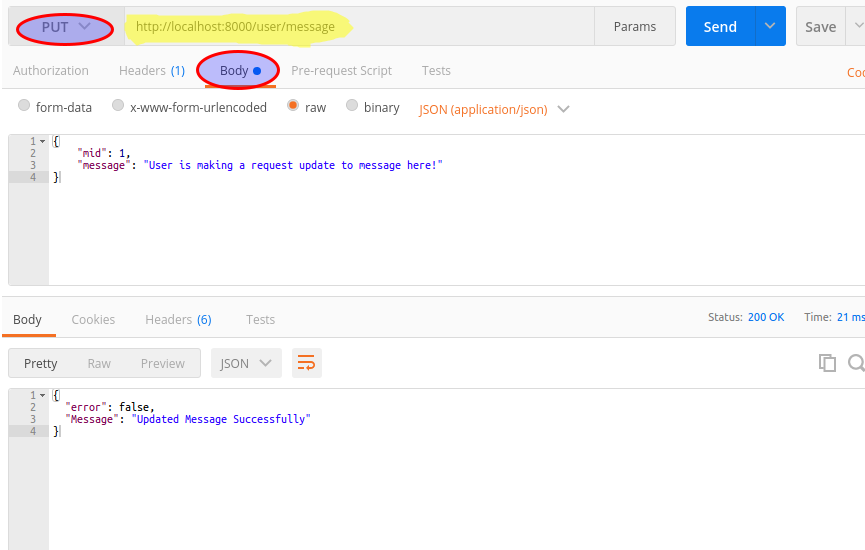

## Docker NodeRestfulAPI and Mysql Container
- ~~Create your Database locally~~
~~Download and Install Node JS and MySQL Software.
Create the Database using the sample SQL scripts provided in `dbsetup.sql` file.~~


- Clone the Project
Open a terminal and run the following commands.
```
$ git clone https://github.com/Gmanweb/NodeRestfulAPI.git

$ cd NodeRestfulAPI
```
### Docker Mysql, Node Rest API
Build the compose file, run the following command.

```
docker-compose build
```

Run the docker compose file to download and run a mysql and node rest api containers in there own network.

```
docker-compose up -d
```

should return something like.

```
Compose does not use swarm mode to deploy services to multiple nodes in a swarm. All containers will be scheduled on the current node.

To deploy your application across the swarm, use `docker stack deploy`.

Creating network "noderestfulapi_apinetwork" with driver "bridge"
Creating noderest
Creating mysql.dev
```

Create tables and insert data in DB, run the following command

```
docker exec mysql.dev bash /tmp/importdb.sh`
```

#### Destroy/remove the containers and network.
Run the following command to remove all the containers and network at once.

```
docker-compose down
```

should return below message in the terminal.

```
Stopping mysql.dev ... done
Stopping noderest ... done
Removing mysql.dev ... done
Removing noderest ... done
Removing network noderestfulapi_apinetwork
```

#### Inspect the container and/or network

**network**

```
docker inspect noderestfulapi_apinetwork
```

**container**

```
docker inspect noderest
docker inspect mysql.dev
```

~~~~- **Start node server**
Open another terminal in the same folder 'NodeRestfulAPI' and run the folling command, the configuration has the container name hard coded in db url.~~

~~node server.js~~

~~> which should return:~~

~~Connected & Listen to port 8000~~

Open your browser
```
http://localhost:8000/users
```

#### Mysql Data persistent to host
Location `/apps/docker/mysql/` this is set in the Docker-compose file.
Remove the data, run `sudo rm -r /apps/docker/mysql/`

### Rest Calls
##### GET users
> `http://localhost:8000/users`
```
{
	error: false,
	Users: [ 
	{
		uid: 1,
		username: "gman",
		password: "password",
		email: "gm@n.ie"
	},{
		uid: 2,
		username: "web",
		password: "password",
		email: "web@n.ie"
	}]
}
```
##### GET user `2`
> `http://localhost:8000/user/2`
```
{
	error: false,
	Users: [ 
	{
		uid: 2,
		username: "web",
		password: "password",
		email: "web@n.ie"
	}]
}
```
##### GET messages for user `1`
>`http://localhost:8000/user/messages/1`
```
{
	error: false,
	Messages: [
	{
		mid: 1,
		message: "User is making a request"
	},
	{
		mid: 2,
		message: "Check out the Restful service here"
	},
	{
		mid: 3,
		message: "This REST is the real deal"
	}]
}
```
Use a rest client like [POSTMAN](https://chrome.google.com/webstore/detail/postman/fhbjgbiflinjbdggehcddcbncdddomop?hl=en) REST  Extention to make the PUT request
##### PUT update message for user `1`
>`http://localhost:8000/user/message`

**Request:**
```
{
	"mid": 1,
	"message": "User is making a request update to message here!"
}
```
**Response:**
```
{
  "error": false,
  "Message": "Updated Message Successfully"
}
```

Screenshot:




